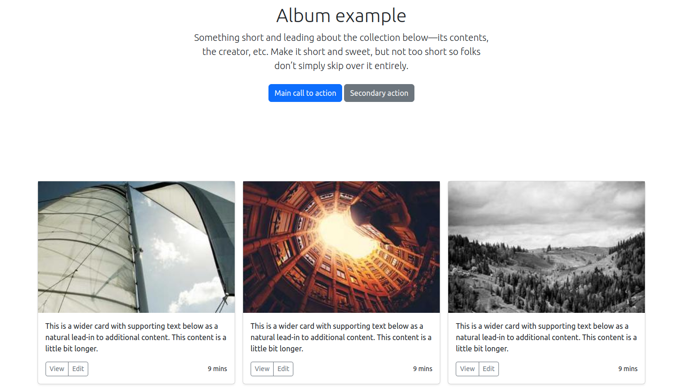

## Présentation du projet
Application qui présente une galerie d'image aléatoire 

## Notions abordées
- Utilisation de `Twig`et `Bootstrap`
- Création d'un controlleur
- bouche en `PHP` pour générer les images aléatoire

## Prérequis

- PHP 8.2
- Symfony 7

